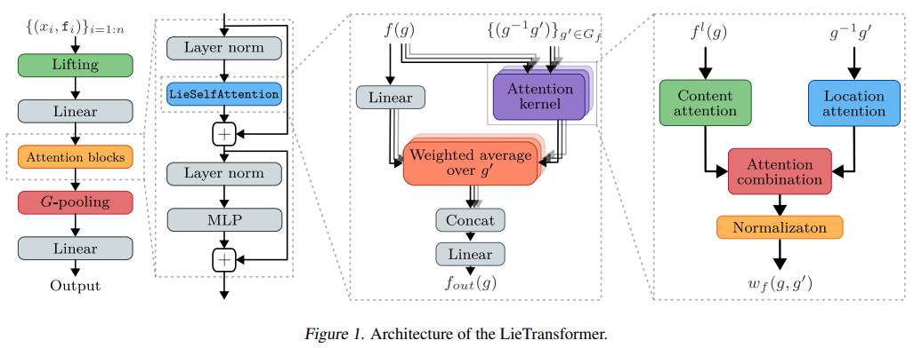

</img>

</img>

## Lie Transformer - Pytorch (wip)

Implementation of <a href="https://arxiv.org/abs/2012.10885">Lie Transformer</a>, Equivariant Self-Attention, in Pytorch. Only the SE3 version will be present in this repository, as it may be needed for Alphafold2 replication.

## Install

```bash
$ pip install lie-transformer-pytorch
```

## Usage

```python
import torch
from lie_transformer_pytorch import LieTransformer

model = LieTransformer(
    dim = 512,
    depth = 2,
    heads = 8,
    dim_head = 64,
    liftsamples = 4
)

coors = torch.randn(1, 64, 3)
features = torch.randn(1, 64, 512)
mask = torch.ones(1, 64).bool()

out = model((coors, features, mask)) # (1, 256, 512) <- 256 = (seq len * liftsamples)
```

## Todo

- [ ] Figure out location based attention as described in section 3.2 - any help is appreciated here

## Credit

This repository is largely adapted from <a href="https://github.com/mfinzi/LieConv">LieConv</a>, cited below!

## Citations

```bibtex
@misc{hutchinson2020lietransformer,
    title       = {LieTransformer: Equivariant self-attention for Lie Groups}, 
    author      = {Michael Hutchinson and Charline Le Lan and Sheheryar Zaidi and Emilien Dupont and Yee Whye Teh and Hyunjik Kim},
    year        = {2020},
    eprint      = {2012.10885},
    archivePrefix = {arXiv},
    primaryClass = {cs.LG}
}
```

```bibtex
@misc{finzi2020generalizing,
    title   = {Generalizing Convolutional Neural Networks for Equivariance to Lie Groups on Arbitrary Continuous Data}, 
    author  = {Marc Finzi and Samuel Stanton and Pavel Izmailov and Andrew Gordon Wilson},
    year    = {2020},
    eprint  = {2002.12880},
    archivePrefix = {arXiv},
    primaryClass = {stat.ML}
}
```
